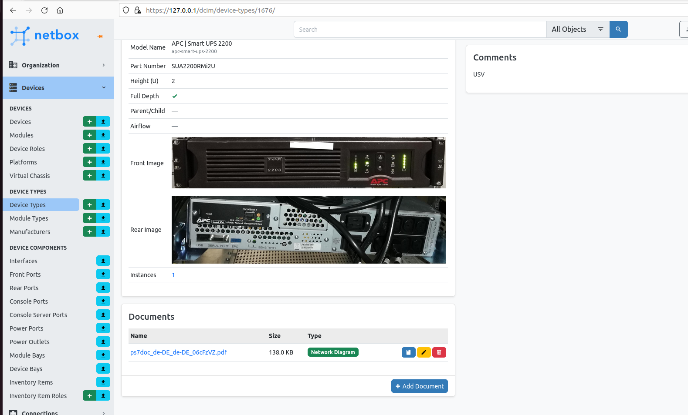
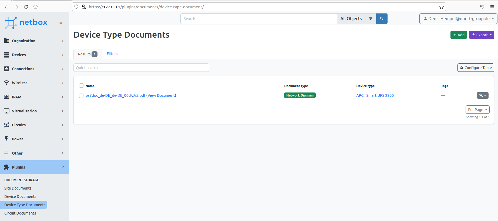

# Netbox Documents Plugin

A plugin designed to faciliate the storage of site, circuit, device type and device specific documents within [NetBox](https://github.com/netbox-community/netbox)

**Note: Netbox v3.2+ is required. This plugin will not work on an earlier release of Netbox.**

# Installation

A working installation of Netbox 3.2+ is required - [see official documentation](https://netbox.readthedocs.io/en/stable/plugins/).

### Package Installation from PyPi

Activate your virtual env and install via pip:

```
$ source /opt/netbox/venv/bin/activate
(venv) $ pip install netbox-documents
```

To ensure the Netbox Documents plugin is automatically re-installed during future upgrades, add the package to your `local_requirements.txt` :

```no-highlight
# echo netbox-documents >> local_requirements.txt
```

### Enable the Plugin

In the Netbox `configuration.py` configuration file add or update the PLUGINS parameter, adding `netbox_documents`:

```python
PLUGINS = [
    'netbox_documents',
]
```

(Optional) Add or update a PLUGINS_CONFIG parameter in `configuration.py` to configure plugin settings. Options shown below are the configured defaults:

```python
PLUGINS_CONFIG = {
     'netbox_documents': {
         # Enable the management of site specific documents (True/False)
         'enable_site_documents': True,
         # Enable the management of circuit specific documents (True/False)
         'enable_circuit_documents': True,
         # Enable the management of device specific documents (True/False)
         'enable_device_documents': True,
         # Enable the management of device type specific documents (True/False)
         'enable_device_type_documents': True,
         # Enable the global menu options (True/False)   
         'enable_navigation_menu': True,
         # Location to inject the document widget in the site view (left/right)
         'site_documents_location': 'left',
         # Location to inject the document widget in the device view (left/right
         'device_documents_location': 'left',
         # Location to inject the document type widget in the device type view (left/right
         'device_type_documents_location': 'left',
         # Location to inject the document widget in the device view (left/right
         'circuit_documents_location': 'left'
     }
}

```

(Optional) Add or replace the built-in Document Type choices via Netbox's [`FIELD_CHOICES`](https://netbox.readthedocs.io/en/feature/configuration/optional-settings/#field_choices) configuration parameter:

The colours that can be used are listed in the Netbox CSS netbox-light.css:

(https://github.com/netbox-community/netbox/blob/develop/netbox/project-static/dist/netbox-light.css)

The bg- must not be specified in the configuration.
Here are a few examples from the CSS:

* bg-indigo = #6610f2 --> 'indigo'
* bg-blue = #0d6efd --> 'blue'
* bg-purple = #6f42c1 --> 'purple'
* bg-pink = #d63384 --> 'pink'
* bg-red = #dc3545 --> 'red'
* bg-orange = #fd7e14 --> 'orange'
* bg-yellow = #ffc107 --> 'yellow'
* bg-green = #198754 --> 'green'
* bg-teal = #20c997 --> 'teal'
* bg-cyan = #0dcaf0 --> 'cyan'
* bg-gray = #adb5bd --> 'gray'
* bg-black = #000 --> 'black'
* bg-white --> 'white'

```python
FIELD_CHOICES = {
    'netbox_documents.DocTypeChoices.site+': (
        ('mydocument', 'My Custom Site Document Type', 'green'),
    ),
    'netbox_documents.DocTypeChoices.device+': (
        ('mydocument', 'My Custom Device Document Type', 'green'),
    ),
    'netbox_documents.DocTypeChoices.devicetype+': (
        ('mydocument', 'My Custom Device Type Document Type', 'green'),
    ),
    'netbox_documents.DocTypeChoices.circuit+': (
        ('mydocument', 'My Custom Circuit Document Type', 'green'),
    )
}
```

### Apply Database Migrations

Apply database migrations with Netbox `manage.py`:

```
(venv) $ python manage.py migrate
```

### Restart Netbox

Restart the Netbox service to apply changes:

```
sudo systemctl restart netbox
```

### Re-index Netbox search index (Upgrade to 3.4 only)

If you are upgrading from Netbox 3.2 or above to Netbox 3.4, any previously inserted documents may not show up in the new search feature. To resolve this, re-index the plugin:

```
(venv) $ python manage.py reindex netbox_documents
```

### Screenshots




