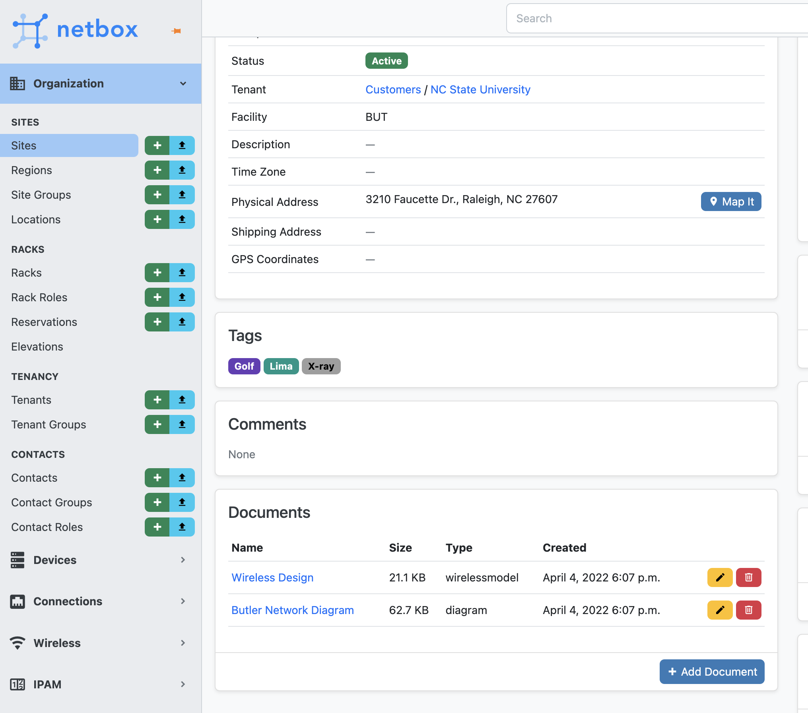
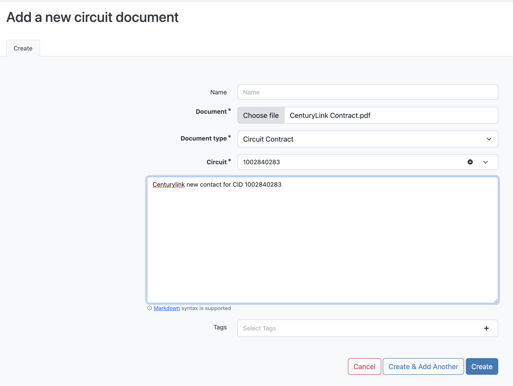
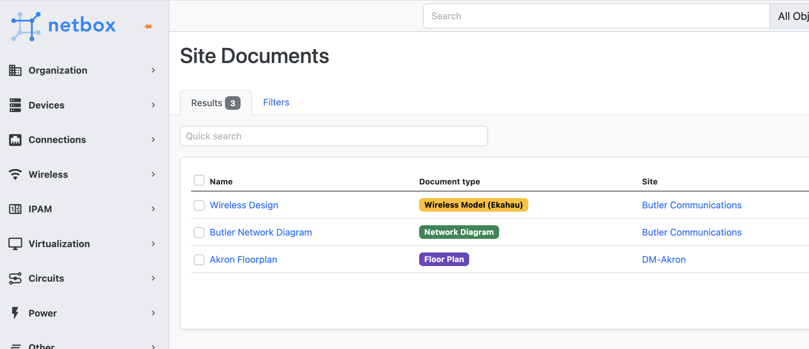
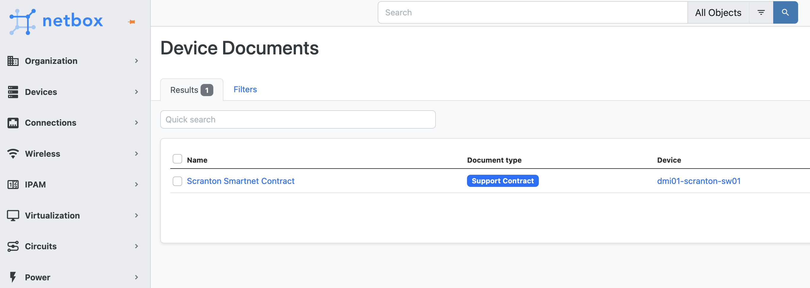
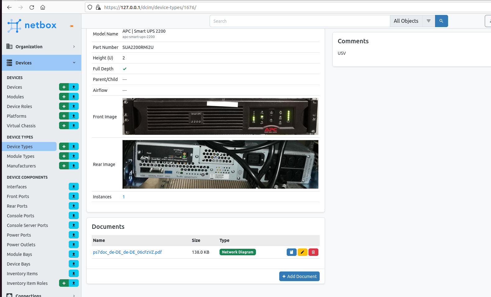
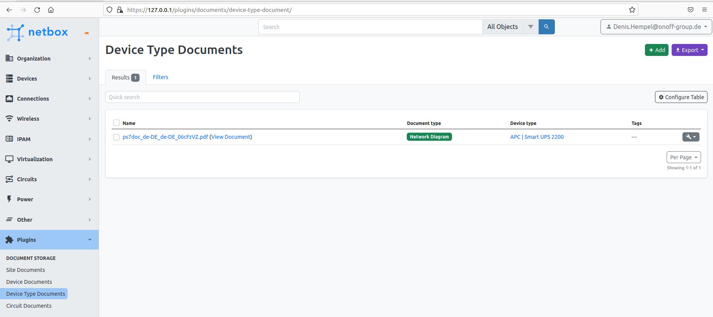

# Netbox Documents Plugin

A plugin designed to facilitate the storage of documents against any object within [NetBox](https://github.com/netbox-community/netbox).

## Features

* Attach documents to **any** NetBox model, including:
   - Sites, Locations
   - Devices, Device Types, Module Types
   - Circuits, Circuit Providers
   - Virtual Machines
* Upload documents to your NetBox media/ folder or any Django-supported storage backend (e.g. S3)
* Store links to external URLs to avoid duplicating remote documents
* Supports a wide array of file types: bmp, gif, jpeg, jpg, png, pdf, txt, doc, docx, xls, xlsx, xlsm, tif, tiff, drawio, svg, webp, html, pptx
* Add custom document types via plugin configuration
* Control which document types are available per model
* Documents panel appears on object detail pages with permission-aware action buttons

## Compatibility

| NetBox Version | Plugin Version |
|----------------|----------------|
|     4.3+       |      0.8.2     |
|     4.3+       |      0.7.4     |
|     4.2+       |      0.7.2     |
|  4.0 - 4.1     |      0.7.0     |
|     3.6+       |      0.6.4     |
|     3.5.x      |      0.6.0     |
| 3.3.x - 3.4.x  |      0.5.1     |


## Upgrading to 0.8.2

> **Breaking Changes:** Version 0.8.2 is a major refactoring. Please read carefully before upgrading.

### What changed

The plugin previously used 8 separate database models (SiteDocument, DeviceDocument, CircuitDocument, etc.). Version 0.8.2 replaces these with a single unified `Document` model using Django's ContentType framework (GenericForeignKey). This enables documents to be attached to any NetBox model.

### Breaking changes

* **API endpoints changed:** The 8 separate API endpoints (`/api/plugins/netbox-documents/site-documents/`, `/api/plugins/netbox-documents/device-documents/`, etc.) have been replaced with a single endpoint: `/api/plugins/netbox-documents/documents/`. API clients must be updated.
* **URL paths changed:** All web UI paths have changed from model-specific paths (e.g. `/plugins/documents/site-document/`) to a single path: `/plugins/documents/documents/`. Any bookmarks or external links will need updating.
* **Permissions renamed:** Model-specific permissions (e.g. `view_sitedocument`, `add_devicedocument`) are replaced with unified permissions: `view_document`, `add_document`, `change_document`, `delete_document`. Permission assignments will need updating.
* **FIELD_CHOICES key changed:** The per-model `DocTypeChoices` keys (e.g. `DocTypeChoices.site`, `DocTypeChoices.device`) are replaced with a single key: `DocTypeChoices.document`. See the configuration section below for the new approach to custom document types.
* **Configuration simplified:** The 16 per-model settings (`enable_site_documents`, `site_documents_location`, etc.) have been removed. They are replaced by a single `documents_location` setting. The documents panel now always appears on supported model detail pages. Custom document types are now configured via `custom_doc_types` instead of `FIELD_CHOICES`.

### Upgrade procedure

1. **Back up your database** before upgrading.
2. Install the new version: `pip install netbox-documents==0.8.2`
3. Run migrations: `python manage.py migrate`
4. Update any API integrations to use the new `/api/plugins/netbox-documents/documents/` endpoint
5. Update any permission assignments to use the new `document` permission names
6. Update your `PLUGINS_CONFIG` if you used `FIELD_CHOICES` for custom document types (see below)
7. Restart NetBox: `sudo systemctl restart netbox`
8. Re-index search: `python manage.py reindex netbox_documents`


## Installation

A working installation of NetBox 4.3+ is required.

#### Package Installation from PyPI

Activate your virtual env and install via pip:

```
$ source /opt/netbox/venv/bin/activate
(venv) $ pip install netbox-documents
```

To ensure the plugin is automatically re-installed during future upgrades, add the package to your `local_requirements.txt`:

```
# echo netbox-documents >> local_requirements.txt
```

#### Enable the Plugin

In the NetBox `configuration.py` file add or update the PLUGINS parameter:

```python
PLUGINS = [
    'netbox_documents',
]
```

#### Apply Database Migrations

```
(venv) $ python manage.py migrate
```

#### Restart NetBox

```
sudo systemctl restart netbox
```


## Configuration

Add or update a `PLUGINS_CONFIG` parameter in `configuration.py` to configure plugin settings. All settings are optional -- the defaults are shown below:

```python
PLUGINS_CONFIG = {
    'netbox_documents': {

        # Enable the global navigation menu
        'enable_navigation_menu': True,

        # Location of the documents panel on object detail pages (left/right)
        'documents_location': 'left',

        # Custom document types (see below)
        'custom_doc_types': [],

        # Per-model document type filtering (see below)
        'allowed_doc_types': {},
    }
}
```

### Custom Document Types

Add your own document types by defining them in `custom_doc_types`. Each entry is a tuple of `(value, label, color)`:

```python
PLUGINS_CONFIG = {
    'netbox_documents': {
        'custom_doc_types': [
            ('sla', 'SLA Document', 'teal'),
            ('warranty', 'Warranty Document', 'cyan'),
            ('asbuilt', 'As-Built Drawing', 'lime'),
            ('audit', 'Audit Report', 'black'),
        ],
    }
}
```

Custom types appear alongside the built-in types in all dropdowns and filters. Available colors: green, purple, orange, indigo, yellow, pink, blue, red, gray, teal, cyan, white, black.

The built-in document types are: diagram, floorplan, purchaseorder, quote, wirelessmodel, manual, supportcontract, circuitcontract, contract, msa, kmz, other.

### Per-Model Document Type Filtering

Control which document types appear in the dropdown for each model using `allowed_doc_types`. Keys are model labels in `app_label.model` format. The special key `__all__` sets the default for any model not explicitly listed:

```python
PLUGINS_CONFIG = {
    'netbox_documents': {
        'allowed_doc_types': {
            'dcim.site': ['diagram', 'floorplan', 'purchaseorder', 'quote', 'wirelessmodel', 'other'],
            'dcim.location': ['diagram', 'floorplan', 'purchaseorder', 'quote', 'wirelessmodel', 'other'],
            'dcim.device': ['diagram', 'manual', 'purchaseorder', 'quote', 'supportcontract', 'other'],
            'dcim.devicetype': ['diagram', 'manual', 'purchaseorder', 'quote', 'supportcontract', 'other'],
            'dcim.moduletype': ['diagram', 'manual', 'purchaseorder', 'quote', 'supportcontract', 'other'],
            'circuits.circuit': ['circuitcontract', 'diagram', 'purchaseorder', 'quote', 'kmz', 'other'],
            'circuits.provider': ['contract', 'msa', 'purchaseorder', 'quote', 'other'],
            'virtualization.virtualmachine': ['diagram', 'manual', 'purchaseorder', 'quote', 'supportcontract', 'other'],
        },
    }
}
```

If `allowed_doc_types` is empty (`{}`), all document types are shown for all models (the default).

Use the `__all__` key to set a default for all models, then override specific models as needed:

```python
PLUGINS_CONFIG = {
    'netbox_documents': {
        'allowed_doc_types': {
            # Default: only show these types for all models
            '__all__': ['diagram', 'purchaseorder', 'quote', 'other'],

            # Override: Sites also get floorplan and wirelessmodel
            'dcim.site': ['diagram', 'floorplan', 'purchaseorder', 'quote', 'wirelessmodel', 'other'],

            # Override: Circuits get circuit-specific types
            'circuits.circuit': ['circuitcontract', 'diagram', 'purchaseorder', 'quote', 'kmz', 'other'],
        },
    }
}
```

Custom types defined in `custom_doc_types` can also be referenced in `allowed_doc_types`:

```python
PLUGINS_CONFIG = {
    'netbox_documents': {
        'custom_doc_types': [
            ('sla', 'SLA Document', 'teal'),
        ],
        'allowed_doc_types': {
            '__all__': ['diagram', 'purchaseorder', 'quote', 'other'],
            'circuits.provider': ['contract', 'msa', 'sla', 'other'],
        },
    }
}
```


## API Usage

All documents are accessed through a single REST API endpoint:

```
GET    /api/plugins/netbox-documents/documents/          # List all documents
POST   /api/plugins/netbox-documents/documents/          # Create a document
GET    /api/plugins/netbox-documents/documents/{id}/     # Get a document
PUT    /api/plugins/netbox-documents/documents/{id}/     # Update a document
DELETE /api/plugins/netbox-documents/documents/{id}/     # Delete a document
```

Filter by object type and ID:

```
GET /api/plugins/netbox-documents/documents/?content_type=dcim.site&object_id=1
```

Create a document attached to a site (ID 1):

```json
POST /api/plugins/netbox-documents/documents/
{
    "name": "Network Diagram",
    "document_type": "diagram",
    "external_url": "https://example.com/diagram.pdf",
    "content_type": "dcim.site",
    "object_id": 1
}
```


## Screenshots







