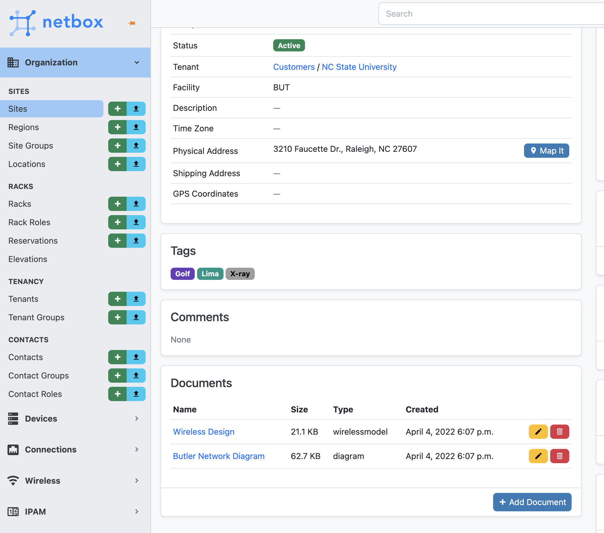
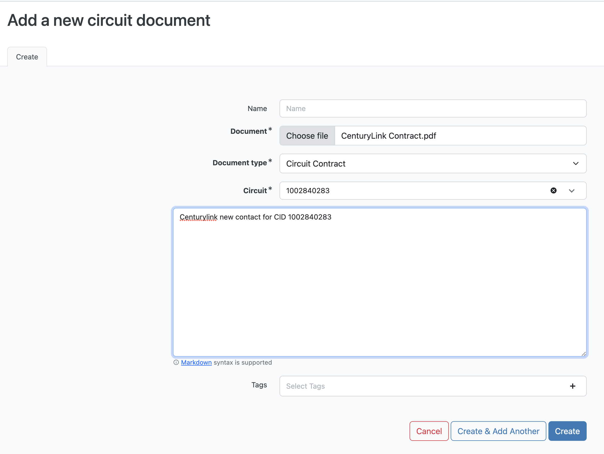
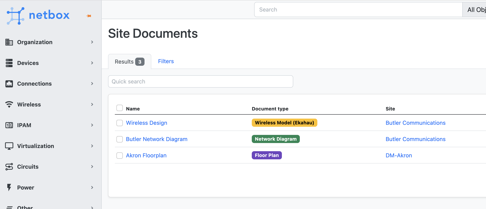
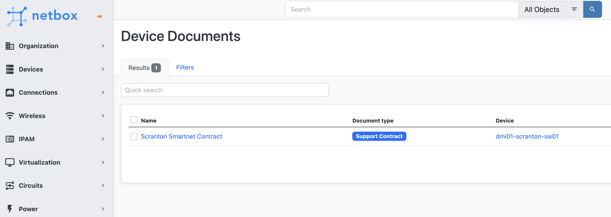

# Netbox Documents Plugin

A plugin designed to faciliate the storage of site, circuit and device specific documents within [NetBox](https://github.com/netbox-community/netbox) 

**Note: Netbox v3.2+ is required. This plugin will not work on an earlier release of Netbox.**

# Installation

A working installation of Netbox 3.2+ is required - [see official documentation](https://netbox.readthedocs.io/en/stable/plugins/).

### Package Installation from PyPi

Activate your virtual env and install via pip:
```
$ source /opt/netbox/venv/bin/activate
(venv) $ pip install netbox-documents
```

To ensure the Netbox Documents plugin is automatically re-installed during future upgrades, add the package to your `local_requirements.txt` :

```no-highlight
# echo netbox-documents >> local_requirements.txt
```

### Enable the Plugin
In the Netbox `configuration.py` configuration file add or update the PLUGINS parameter, adding `netbox_documents`:
```python
PLUGINS = [
    'netbox_documents',
]
```

(Optional) Add or update a PLUGINS_CONFIG parameter in `configuration.py` to configure plugin settings. Options shown below are the configured defaults:
```python
PLUGINS_CONFIG = {
     'netbox_documents': {
         # Enable the management of site specific documents (True/False)
         'enable_site_documents': True,
         # Enable the management of circuit specific documents (True/False)
         'enable_circuit_documents': True,
         # Enable the management of device specific documents (True/False)
         'enable_device_documents': True,
         # Enable the global menu options (True/False)
         'enable_navigation_menu': True,
         # Location to inject the document widget in the site view (left/right)
         'site_documents_location': 'left',
         # Location to inject the document widget in the device view (left/right
         'circuit_documents_location': 'left',
         # Location to inject the document widget in the circuit view (left/right
         'device_documents_location': 'left'
     }
}

```

(Optional) Add or replace the built-in Document Type choices via Netbox's [`FIELD_CHOICES`](https://netbox.readthedocs.io/en/feature/configuration/optional-settings/#field_choices) configuration parameter:

```python
FIELD_CHOICES = {
    'netbox_documents.DocTypeChoices.site+': (
        ('mydocument', 'My Custom Site Document Type', 'green'),
    ),
    'netbox_documents.DocTypeChoices.device+': (
        ('mydocument', 'My Custom Device Document Type', 'green'),
    ),
    'netbox_documents.DocTypeChoices.circuit+': (
        ('mydocument', 'My Custom Circuit Document Type', 'green'),
    )
}
```

Available 

### Apply Database Migrations
Apply database migrations with Netbox `manage.py`:
```
(venv) $ python manage.py migrate
```

### Restart Netbox
Restart the Netbox service to apply changes:
```
sudo systemctl restart netbox
```

### Screenshots



